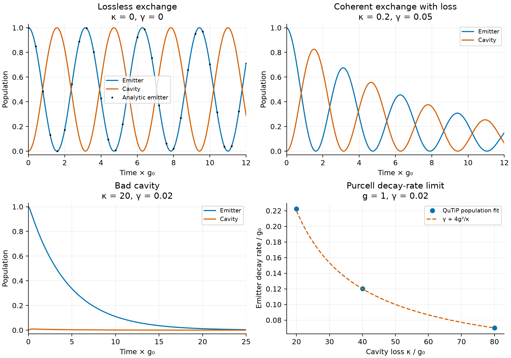

# Quantum-dot cavity dynamics with QuTiP

The Jaynes–Cummings model describes excitation exchange between a two-level emitter and a cavity. Lindblad operators describe cavity loss and emitter decay.



## Setup

```sh
git clone https://github.com/Jhnnn001/quantum-qutip-strong.git
cd quantum-qutip-strong
conda env create -f environment.yml
conda activate quantum-qutip-strong
```

## Run

```sh
python test_project.py
python example.py
```

`cavity_qed.py` contains the model. `example.py` generates population and decay-rate data in `results/`.

## Result

With zero loss, emitter and cavity populations follow `cos²(gt)` and `sin²(gt)`. In the bad-cavity limit, the emitter decay rate approaches `γ + 4g²/κ`.

## References

- Jaynes and Cummings, [Comparison of quantum and semiclassical radiation theories](https://doi.org/10.1109/PROC.1963.1664).
- [QuTiP Jaynes–Cummings example](https://qutip.readthedocs.io/en/stable/guide/dynamics/dynamics-master.html#example-jaynes-cummings-model).
